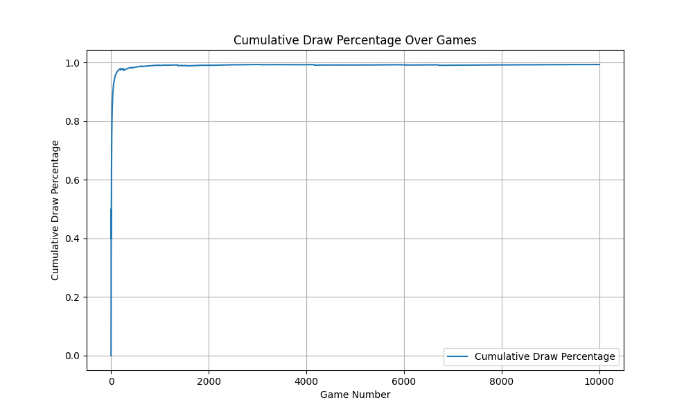

# TicTacToe RL Agents

This repository contains a solution for training reinforcement learning agents to play Tic-Tac-Toe. Two tabular Q-learning agents learn to play the game by competing against each other, refining their strategies through self-play.

## Problem Statement
The task involves creating two independent reinforcement learning agents:
- One agent learns to play as "X."
- The other agent learns to play as "O."

The agents improve their gameplay over time by updating their Q-values based on rewards from games played against each other. An optimal agent either wins or forces a draw without losing.

## Solution Overview
This solution employs **tabular Q-learning** for both agents. Key features include:
- **State-Action Representation:** Agents maintain Q-tables to track the expected rewards of actions in each state.
- **Epsilon-Greedy Exploration:** Encourages a balance between exploring new actions and exploiting known strategies.
- **Learning and Discount Factors:** Adjust the agent's learning rate (`ALPHA`) and focus on future rewards (`GAMMA`).
- **Performance Tracking:** Tracks the percentage of drawn games as a measure of agent improvement.

## Learning Curve

The plot below demonstrates the learning curve of the two reinforcement learning agents playing Tic-Tac-Toe. Over time, the agents converge toward optimal strategies, as evidenced by the cumulative draw percentage nearing 100%.



This graph reflects the cumulative percentage of games ending in a draw as the agents learn through self-play. An optimal strategy ensures that the agents avoid losing, resulting in either a win or a draw.

## Key Files
- **tic_tac_toe_env.py**: Defines the Tic-Tac-Toe environment with methods for managing the game state, available actions, and rewards.
- **tic_tac_toe_solution.py**: Implements the Q-learning agents, training loop, and performance analysis.

## Dependencies
The project uses the following Python libraries:
- `gymnasium`: For the Tic-Tac-Toe environment.
- `pandas`: For data analysis and logging results.
- `matplotlib`: For visualizing agent performance.

Install dependencies via:
```bash
pip install gymnasium pandas matplotlib
